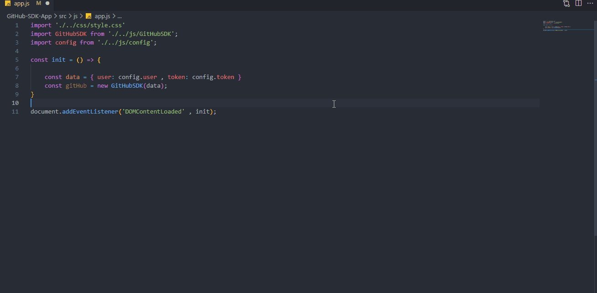

# GitHub SDK



## Overview 🔍
The aim of the project was to create an app similar to Client or [SDK application](https://pl.wikipedia.org/wiki/Software_development_kit) for GitHub API - a library that will make the use of available solutions easier. The assumption of the project was that the library should be developed in accordance with the TDD methodology.

&nbsp;

## Built with 🔧


&nbsp;
## Installation and configuration💾

If you want to try a project, download it then use the command below in terminal

````
npm i
````
&nbsp;

An additional task will be to create the `config.js` file in the `./src/js` folder. The file should have the following structure:

````
const config = {
    user: 'yourUserName',
    token: 'yourToken'
}
module.exports = config;
````


If you don't know how to generate a token, see this [link](https://docs.github.com/en/authentication/keeping-your-account-and-data-secure/creating-a-personal-access-token)

&nbsp;

To start the tests use command below:

````
npm run test
````
&nbsp;

To start the development mode use command below:

````
npm start
````
&nbsp;

## Usage 💡

This library provides access to the following activities:


### Retrieving user information:

#### getUserData()

Returns information about the user whose name was passed in the function parameter.

````
const userData = gitHub.getUserData('KajetanKisielewski');
````

An example of using the data returned by this method:

&nbsp;

##### getUserAvatar()

Returns as a string the url to the avatar of the user whose name was passed in the function parameter.

````
const userAvatar = gitHub.getUserAvatar('KajetanKisielewski);
````

An example of how this method is built using the getUserData() method.

````
async getUserAvatar(userName) {
        const data = await this.getUserData(userName);
        return data.avatar_url;
    }
````

&nbsp;

##### getUserProfileUrl()

Returns as a string the url to the gitHub profile of the user whose name was passed in the function parameter.

````
const url = gitHub.getUserProfileUrl();
````


&nbsp;
### Retrieving information about repositories and creating new ones:


#### getUserRepositories()

Returns a list of public repositories for the user whose name was passed in the function parameter.

````
const repoList = gitHub.getUserRepositories('KajetanKisielewski');
````

&nbsp;
#### getUserRepository()

Returns the public repository of the user whose name was passed in the function parameter. As the second parameter, we must provide the name of this repository.


````
const repo = gitHub.getUserRepository('KajetanKisielewski' , 'Resposive-page--project')
````

&nbsp;
#### getRepositoryContent()

Returns the contents of a file or directory in a repository. It requires three parameters, the first is the username, the second is the repository name, the third is the path to the file we want to download.

````
const content = gitHub.getRepositoryContent('KajetanKisielewski' , 'Resposive-page--project' , 'README.md')
````

&nbsp;
#### getRepositoriesOfAuthenticatedUser()

Returns all repositories of the authenticated user.

````
const repoList = gitHub.getRepositoriesOfAuthenticatedUser();
````

Method:

````
    async getRepositoriesOfAuthenticatedUser() {
        const options = this._fetchGetOptions();
        const url = `${this.url}user/repos?affiliation=owner&per_page=100&`

        return this._fetch(url , options, 'user repositories has not been downloaded');
    }
````

Additional options that I used in the method:

 - affiliation = owner  -> Repositories that are owned by the authenticated user
 - per_page = 100  -> Results per page (max: 100 , default: 30)


For more options please refer to the [documentation](https://docs.github.com/en/rest/reference/repos#list-repositories-for-the-authenticated-user)

&nbsp;
#### createRepository()

This method create a new repository at your github. As a parameter you need to pass the data needed to create the repository(name is required). Example:

````
const data = {
        name: 'helloWorld',
        description: 'This is your first repo created by that library'
}

gitHub.createRepository(data)
````

For more options please refer to the [documentation](https://docs.github.com/en/rest/reference/repos#create-a-repository-for-the-authenticated-user)


&nbsp;
### Retrieve information about commits in the repository and comments to them and about issue in these repositories.


#### getCommitsListFromRepo()

Returns commits from the repository for the user whose name was passed in the function as a first parameter. Second parameter is name of repository.


````
const commitsList = gitHub.getCommitsListFromRepo('KajetanKisielewski' , 'Resposive-page--project')
````


#### getCommentsFromCommit()

Returns comments from the selected commit. This method takes three parameters, the first is the username, the second is the name of the repository, the third is the commit index from which we want to retrieve comments.

````
const commentsList = gitHub.getCommentsFromCommit('KajetanKisielewski' , 'task-js-api-and-fetch' , 2);
````


#### getIssueFromRepo();

Returns issue rom the repository for the user whose name was passed in the function as a first parameter. Second parameter is name of repository.

````
const issueList = gitHub.getIssueFromRepo('KajetanKisielewski' , 'Resposive-page--project');
````
&nbsp;
## Useful resources 🔗

[GitHub API Docs](https://docs.github.com/en/rest)


## Author 🔥

* Github - [KajetanKisielewski](https://github.com/KajetanKisielewski),
* Linkedin - [KajetanKisielewski](https://www.linkedin.com/in/kajetan-kisielewski-157b60208/).


## Special thanks 🙏🏻

Thanks to my [Mentor - devmentor.pl](https://devmentor.pl/) - for providing me with this task and for code review.